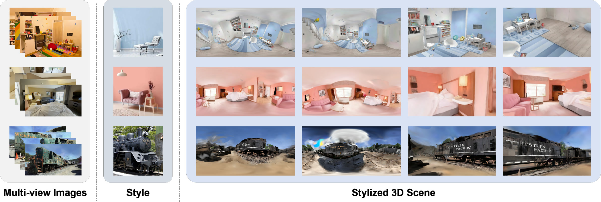

# PanoGS: Panorama-driven Stylization for Gaussian Splatting

Official implementation of "Panorama-based 3D Scene Stylization with Style and Geometry Consistency" — accepted to **IEEE Transactions on Image Processing (TIP) 2026**.

<p align="center">
  
</p>

## Table of Contents

- [Getting Started](#getting-startated)
  - [Installation](#installation)
  - [Diffusion Checkpoints](#diffusion-checkpoints)
- [Usage](#usage)
  - [Quick start (one-shot)](#quick-start-one-shot)
  - [Step-by-step](#step-by-step)
    - [1. Reconstruct the scene](#1-reconstruct-the-scene)
    - [2. Stylize](#2-stylize)
    - [3. Render training views](#3-render-training-views)
- [Configuration](#configuration)
- [Acknowledgements](#acknowledgements)
- [Citation](#citation)

## Getting Started

### Installation

The code is tested with Python 3.8, PyTorch 2.4.1 and CUDA 12.1.

```bash
# clone the repository
git clone https://github.com/<your-org>/PanoGS.git
cd PanoGS

# create the environment
conda env create -f environment.yml
conda activate PanoGS

# build the rasterization submodules (inside 2d_gaussian_splatting)
cd 2d_gaussian_splatting
pip install submodules/diff-surfel-rasterization
pip install submodules/simple-knn
cd ..
```

### Diffusion Checkpoints

PanoGS uses SDXL with ControlNet (canny) and IP-Adapter for stylization. Download the following models from HuggingFace and place them under the `checkpoints/` folder (the paths are resolved in [`diffusers_inference.py`](diffusers_inference.py) relative to the repository root):

```bash
bash download_checkpoints.sh
```

The script requires `huggingface-cli` (`pip install -U "huggingface_hub[cli]"`). It downloads every checkpoint into the following layout:

```
checkpoints/
├── stable-diffusion-xl-base-1.0/
├── IP-Adapter/
│   └── sdxl_models/
│       ├── image_encoder/
│       └── ip-adapter_sdxl.bin
└── controlnet-canny-sdxl-1.0/
```

Alternatively, if you already have the models in a local HuggingFace cache, symlinking them one by one works too.

## Usage

### Quick start (one-shot)

The whole pipeline — reconstruction, stylization and training-view rendering — can be run with a single command via [`start.sh`](start.sh). Edit the variables at the top of the script to point at your scene and style image:

```bash
# input directories
SOURCE=data/my_scene/colmap           # COLMAP source directory
STYLE_IMG=style_data/indoor/room3.jpg # reference style image

# output directories
MODEL_DIR=data_2dgs/output/my_scene   # 2DGS reconstruction output
PREP_DIR=preprocess/my_scene          # stylization output
RENDER_DIR=renders/my_scene            # rendered training views output

# other parameters
GPU=0                                  # CUDA device id
PROMPT=""                             # optional text prompt
ITERS=30000                            # 2DGS training iterations
CONFIG=configs/stylization_default.yaml # stylization config YAML
```

then run:

```bash
bash start.sh
```

Every stage is skipped when its output already exists, so the script can be re-run to resume an interrupted job: if the trained PLY is present, 2DGS training is skipped, and `run_stylization.py` reuses existing panoramas and per-camera stylized models.

If you need to adjust the parameters, see [Configuration](#configuration) and edit the configuration file.

### Step-by-step

The sections below explain each of the three stages individually, for when you need finer control over a single step.

<details>
<summary>Click to expand the step-by-step details</summary>

#### 1. Reconstruct the scene

PanoGS operates on a pre-trained Gaussian scene (2DGS by default, 3DGS PLYs also work). Follow the instructions in the [2d_gaussian_splatting](https://github.com/hbb1/2d-gaussian-splatting) to train one:

```bash
python 2d_gaussian_splatting/train.py \
    -s <path/to/colmap/source> \
    -m <path/to/output/model>
```

#### 2. Stylize

Two scripts run the same stylization pipeline — pick either one:

**Headless** — [`run_stylization.py`](run_stylization.py):

```bash
python run_stylization.py \
    <path/to/point_cloud.ply> \
    -s <path/to/colmap/source> \
    --cameras_json <path/to/cameras.json> \
    --style_img style_data/indoor/room3.jpg \
    --prep_dir preprocess/myrun \
    --prompt ""
```

**Interactive viewer** — [`viewer.py`](viewer.py) exposes the same pipeline through a [viser](https://github.com/nerfstudio-project/viser) GUI:

```bash
python viewer.py \
    <path/to/point_cloud.ply> \
    -s <path/to/colmap/source> \
    --cameras_json <path/to/cameras.json> \
    --style_img style_data/outdoor/paint.jpg \
    --prep_dir preprocess/myrun \
    --port 8088
```

Then open `http://localhost:8088` in your browser.

Key arguments (shared by both front-ends):

| Argument | Description |
| --- | --- |
| `model_path` | Trained Gaussian PLY, 2DGS / 3DGS both supported. |
| `-s / --source_path` | COLMAP source directory of the scene. |
| `--cameras_json` | `cameras.json` of the trained model (camera poses). |
| `--style_img` | Reference style image. Some examples in `style_data/`. |
| `--prep_dir` | Output directory for panoramas, masks and intermediate results. |
| `--prompt` | Optional text prompt. |
| `--config` | Optional OmegaConf YAML overriding the defaults (see [Configuration](#configuration)). |
| `--seed` | Random seed for the panoramic training loop. |

The final stylized model is written to `<prep_dir>/cam_<last>/styled/scene_styled.ply`.

#### 3. Render training views

[`render_training_views.py`](render_training_views.py) renders every training camera of the stylized scene:

```bash
# auto-locate the final styled PLY from a preprocess dir
python render_training_views.py \
    --prep_dir preprocess/myrun \
    -s <path/to/colmap/source> \
    --output_dir renders/myrun

# or stylized PLY given directly
python render_training_views.py \
    --model_path preprocess/myrun/cam_15/styled/scene_styled.ply \
    -s <path/to/colmap/source> \
    --output_dir renders/myrun
```

</details>

## Configuration

All knobs of the headless pipeline live in [`configs/stylization_default.yaml`](configs/stylization_default.yaml). Highlights:

| Section | Key | Description |
| --- | --- | --- |
| `preprocess` | `start_from_center` | start the greedy camera-gap walk from the scene centroid — better for indoor rooms |
| `preprocess` | `camera_gap` | spacing between candidate cameras (× mean NN distance) |
| `preprocess` | `max_candidates` | cap on the number of cameras (0 disables) |
| `stylization` | `train_res` | per-face resolution during the panoramic training loop |
| `stylization` | `train_steps` / `step_per_cam` | base step count / extra steps per camera |
| `stylization` | `knn_number` | K for hidden-point color propagation |

Pass a modified copy with `--config configs/my_config.yaml`; only the listed keys override the defaults.

## Acknowledgements

This project builds on several excellent open-source works:

- [2D Gaussian Splatting](https://github.com/hbb1/2d-gaussian-splatting) — scene reconstruction and surfel rasterization.
- [GaussianEditor](https://github.com/buaacyw/GaussianEditor) — our viser-based interactive viewer is built on top of its editing code.
- [Viser](https://github.com/nerfstudio-project/viser) — the interactive viewer.
- [Diffusers](https://github.com/huggingface/diffusers), [IP-Adapter](https://github.com/tencent-ailab/IP-Adapter) — diffusion-based stylization.
- [AdaIN](https://github.com/naoto0804/pytorch-AdaIN) — fast style transfer initialization.

Thanks to all the authors for releasing their code.

## Citation

If you find this work useful, please cite:

```bibtex
@article{he2026panogs,
  Author  = {Yihong He and Haiyong Jiang and Yuxi Wang and Dongbo Yu and Jun Xiao},
  Title   = {PanoGS: Panorama-based 3D Scene Stylization with Style and Geometry Consistency},
  Journal = {IEEE Transactions on Image Processing},
  Year    = {2026},
  doi     = {10.1109/TIP.2026.3731941},
  note    = {Early Access},
}
```
